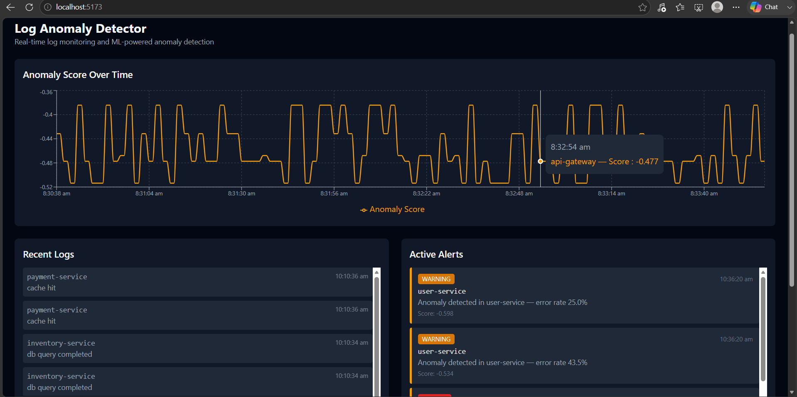

# Log Anomaly Detector

Real-time log ingestion and ML-powered anomaly detection system. Monitors service logs, automatically scores them using an Isolation Forest model, triggers alerts, and notifies via Slack — all visualized on a live dashboard.



## Why this exists

Production systems generate thousands of log lines per minute. When something breaks — a spike in errors, a slow service, an unusual pattern — engineers need to know before users complain. Tools like Datadog and Splunk solve this but cost $15,000+/year. This project builds a simplified version of that pipeline from scratch.

## Architecture

```
Log files → Parser → PostgreSQL → Isolation Forest (ML) → Alert Engine → Slack
                                          ↓
                              React Dashboard (auto-refreshes every 10s)
```

## Features

- **Real-time ingestion** — file watcher detects new log lines automatically
- **ML-based anomaly detection** — Isolation Forest scores log patterns every 60 seconds
- **Automated alerting** — duplicate-safe alert engine with severity classification (critical / warning / info)
- **Slack notifications** — live alerts pushed to a Slack channel via webhook
- **Live dashboard** — React + Recharts visualization of anomaly trends, logs, and alerts
- **Tested** — pytest suite covering core API endpoints

## Tech stack

**Backend:** FastAPI, PostgreSQL, SQLAlchemy, scikit-learn, APScheduler
**Frontend:** React, Vite, Tailwind CSS, Recharts, Axios
**Infra:** Slack Webhooks, pytest

## Setup

### Backend
```bash
cd backend
python3 -m venv venv
source venv/bin/activate
pip install -r requirements.txt
uvicorn app.main:app --reload
```

### Frontend
```bash
cd frontend
npm install
npm run dev
```

### Generate demo data
```bash
python3 scripts/generate_logs.py
curl -X POST "http://127.0.0.1:8000/logs/ingest-file?filepath=../data/sample.log"
curl -X POST "http://127.0.0.1:8000/anomaly/train"
curl -X POST "http://127.0.0.1:8000/anomaly/score"
```

## API endpoints

| Method | Endpoint | Description |
|--------|----------|-------------|
| GET | `/logs/` | List logs (filter by service, level, pagination) |
| POST | `/logs/ingest-file` | Ingest a log file |
| POST | `/anomaly/train` | Train the Isolation Forest model |
| POST | `/anomaly/score` | Score all logs and trigger alerts |
| GET | `/anomaly/history` | Anomaly score history for charting |
| GET | `/alerts/` | List alerts (filter by severity, service) |

## License

MIT